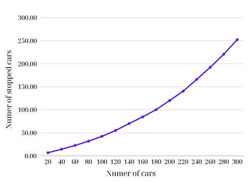
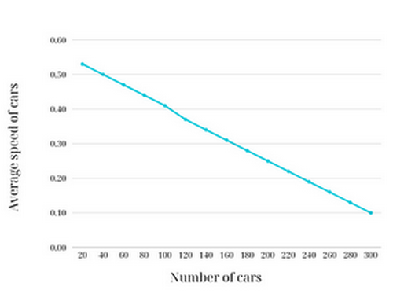
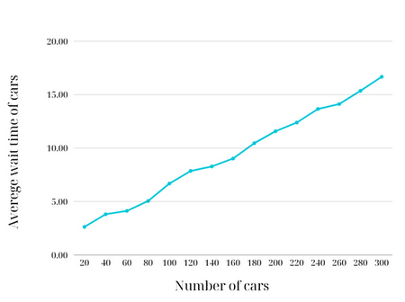

# Комп'ютерні системи імітаційного моделювання
## СПм-23-4, Костін Костянтин Дмитрович
### Лабораторна робота №**1**. Опис імітаційних моделей та проведення обчислювальних експериментів

 

### Варіант 1, модель у середовищі NetLogo:
[Traffic Grid](https://www.netlogoweb.org/launch#http://www.netlogoweb.org/assets/modelslib/Sample%20Models/Social%20Science/Traffic%20Grid.nlogo)

 

### Вербальний опис моделі:
Симуляція руху автомобілів по грід-системі доріг та перехресть. Кожен автомобіль у моделі представлений агентом, який слідує простим набором правил, регулюючи свою швидкість та рух. Розглядає взаємодію автомобілів на дорогах та перехрестях з метою вивчення впливу різних факторів на руховий потік та час очікування. Автомобілі взаємодіють між собою та реагують на світлофори на перехрестях.

### Керуючі параметри:
- **grid-size-x** визначає кількість вертикальних доріг.
- **grid-size-y** визначає кількість горизонтальних доріг.
- **num-cars** визначає автомобілів у симуляції.
- **power** визначає наявність світлофора.
- **ticks-per-cycle** визначає кількість тактів, які минуть для кожного цикл.
- **speed-limit** визначає максимальну швидкість для автомобілів.
- **current-auto** перемикає поточне світло між автоматичним режимом і ручним.
- **current-phase** визначає коли поточне світло змінюється, якщо воно в автоматичному режимі.

### Показники роботи системи:
- зупіненні автомобілі - відображає кількість зупинених автомобілів за час.
- середня швидкість автомобілів - відображає середню швидкість автомобілів за час.
- середний час очікування автомобілів - відображає середній час зупинки автомобілів за певний час.

### Примітки:
Кожного кроку автомобілі намагаються рухатися вперед із поточною швидкістю. Якщо їхня поточна швидкість менша за обмеження швидкості і прямо перед ними немає автомобіля, вони прискорюються. Якщо попереду є повільніша машина, вони зрівняються зі швидкістю повільнішої машини та сповільнюються. Якщо перед ними червоне світло або зупинилася машина, вони зупиняються.

### Недоліки моделі:
Модель не враховує ситуації злиття рядів автомобілів, що може вплинути на реалістичність руху в умовах міста. Модель не враховує вплив погодних умов, дорожньої обстановки або інших факторів, які можуть впливати на рух транспорту в реальному місті. Поведінка автомобілів обмежена простим набором правил, і вони реагують тільки на автомобілі безпосередньо перед ними. Поведінка автомобілів моделюється простою логікою "гальмуй або прискорюй". Це може не враховувати більш складних аспектів руху в реальному місті.

 

## Обчислювальні експерименти
### 1. Вплив завантаженості дороги на кількість зупиненних автомобілів, середньої швидкісті автомобілів та середнього часу очікування автомобілів
Досліджується залежність кількості зупиненних автомобілів, середньої швидкісті автомобілів та середнього часу очікування автомобілів протягом певної кількості тактів (200) від числа машин на трасі, зазначеного на початку симуляції.
Експерименти проводяться при 25-200 автомобілях, з кроком 25, усього 8 симуляцій.  
Інші керуючі параметри мають значення за замовчуванням:
- **grid-size-x**: 5
- **grid-size-y**: 5
- **power**: On
- **ticks-per-cycle**: 20
- **speed-limit**: 1

<table>
<thead>
<tr><th>Кількість автомобілів</th><th>Кількість зупиненних</th><th>Середня швидкість</th><th>Середній час очікування</th></tr>
</thead>
<tbody>
<tr><td>20</td><td>6.85</td><td>0.53</td><td>2.63</td></tr>
<tr><td>40</td><td>14.36</td><td>0.50</td><td>3.81</td></tr>
<tr><td>60</td><td>22.51</td><td>0.47</td><td>4.12</td></tr>
<tr><td>80</td><td>31.88</td><td>0.44</td><td>5.05</td></tr>
<tr><td>100</td><td>42.41</td><td>0.41</td><td>6.68</td></tr>
<tr><td>120</td><td>55.19</td><td>0.37</td><td>7.86</td></tr>
<tr><td>140</td><td>70.02</td><td>0.34</td><td>8.28</td></tr>
<tr><td>160</td><td>84.52</td><td>0.31</td><td>9.02</td></tr>
<tr><td>180</td><td>100.28</td><td>0.28</td><td>10.46</td></tr>
<tr><td>200</td><td>120.01</td><td>0.25</td><td>11.58</td></tr>
<tr><td>220</td><td>140.36</td><td>0.22</td><td>12.39</td></tr>
<tr><td>240</td><td>165.87</td><td>0.19</td><td>13.66</td></tr>
<tr><td>260</td><td>192.17</td><td>0.16</td><td>14.12</td></tr>
<tr><td>280</td><td>220.58</td><td>0.13</td><td>15.36</td></tr>
<tr><td>300</td><td>252.10</td><td>0.10</td><td>16.67</td></tr>
</tbody>
</table>

На основі графіків і таблиці можна зробити висновок, що зі збільшенням завантаженості траси ефективність руху поступово погіршується. Чим більше автомобілів на дорозі, тим більше їх зупиняється, тим нижча середня швидкість і довший середній час очікування.

Проте, система не демонструє чіткої критичної точки, при якій ефективність різко знижується. Натомість, зниження продуктивності відбувається поступово, що свідчить про відносну стійкість системи при підвищених навантаженнях, хоча з меншою швидкістю та довшими очікуваннями.
