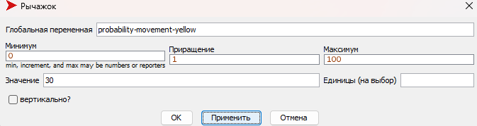
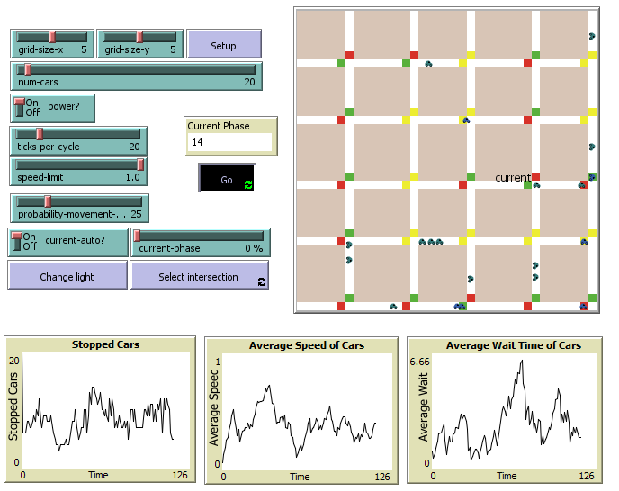
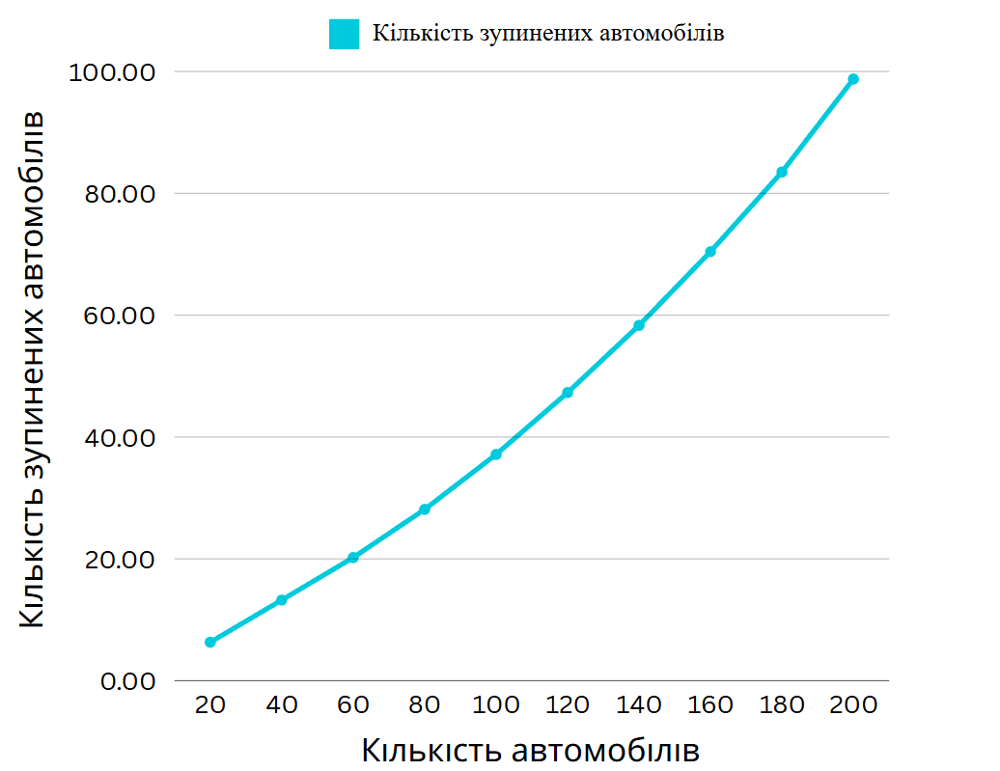
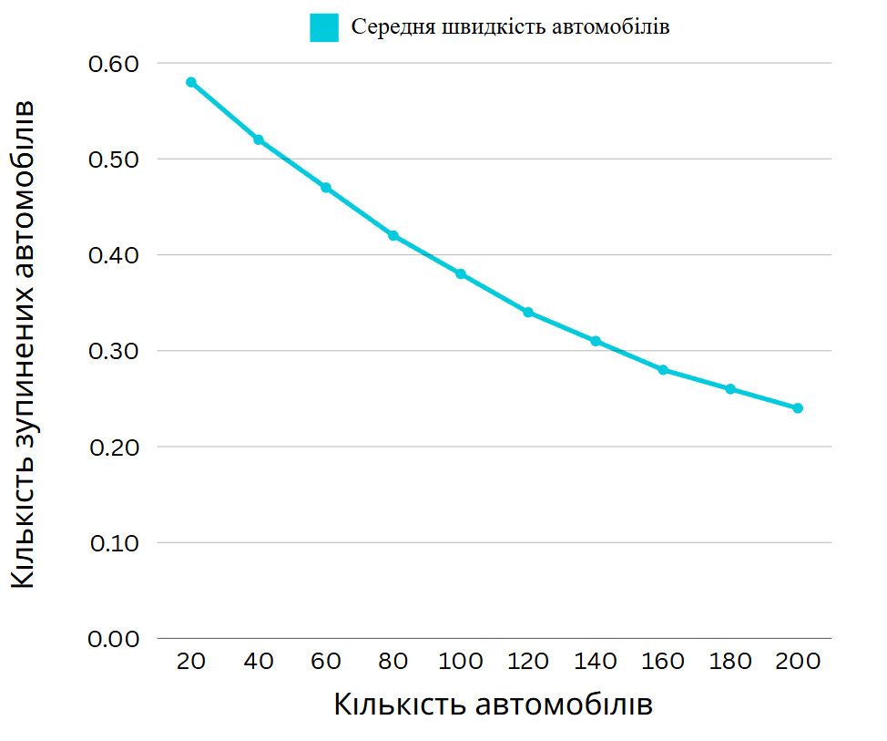
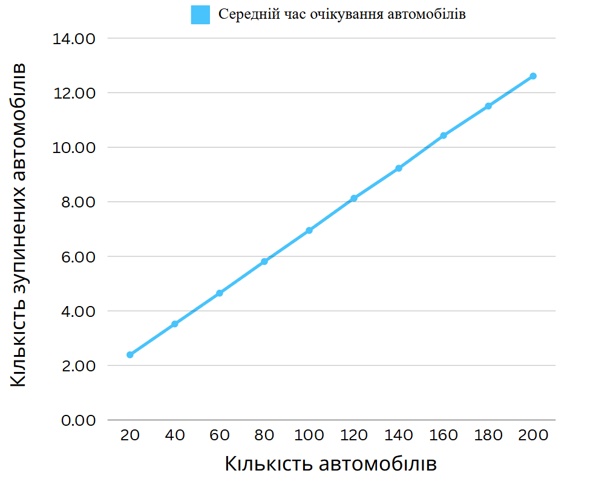

# Комп'ютерні системи імітаційного моделювання
## СПм-23-4, Костін Костянтин Дмитрович
### Лабораторна робота №**2**. Редагування імітаційних моделей у середовищі NetLogo

 

### Варіант 1, модель у середовищі NetLogo:
[Traffic Grid](https://www.netlogoweb.org/launch#http://www.netlogoweb.org/assets/modelslib/Sample%20Models/Social%20Science/Traffic%20Grid.nlogo)

 

### Внесені зміни у вихідну логіку моделі, за варіантом:

**Додано жовтий сигнал світлофорів.**

До патчів додано нову змінну, яка вказує, чи увімкнений жовтий сигнал

<pre>
  yellow-light? ;; true if the yellow light is on, false otherwise
</pre> 

Оновлення процедури setup-patches: У процедурі ініціалізації патчів встановлюється початкове значення змінної yellow-light? як false:

<pre>
to setup-patches
    ...
    ask patches
    [
      ...
      set yellow-light? false
      ...
    ]
    ...
end
</pre>

Зміна логіки процедури set-signal-colors: Додано обробку жовтого сигналу для світлофорів. Процедура тепер враховує стан змінної yellow-light?

<pre>
to set-signal-colors  ;; intersection (patch) procedure
  ifelse power?
  [
    ifelse yellow-light?
    [
      ask patch-at -1 0 [ set pcolor yellow ]
      ask patch-at 0 1 [ set pcolor yellow ]
    ]
    [
      ifelse green-light-up?
      [
        ask patch-at -1 0 [ set pcolor red ]
        ask patch-at 0 1 [ set pcolor green ]
      ]
      [
        ask patch-at -1 0 [ set pcolor green ]
        ask patch-at 0 1 [ set pcolor red ]
      ]
    ]
  ]
  [
    ask patch-at -1 0 [ set pcolor white ]
    ask patch-at 0 1 [ set pcolor white ]
  ]
end
</pre>

Оновлення процедури set-signals: Жовтий сигнал додається в цикл роботи світлофорів. Логіка оновлюється залежно від стану yellow-light?

<pre>
to set-signals
  ask intersections with [auto? and phase = floor ((my-phase * ticks-per-cycle) / 100)]
  [
    ifelse yellow-light?
    [
      set yellow-light? false
      set green-light-up? (not green-light-up?)
    ]
    [
      set yellow-light? true
    ]
    set-signal-colors
  ]
end
</pre>

Зміна поведінки автомобілів у процедурі set-car-speed: Автомобілі тепер зупиняються як на червоний, так і на жовтий сигнал світлофора:

<pre>
to set-car-speed  ;; turtle procedure
  ifelse pcolor = red or pcolor = yellow
  ...
end
</pre>

**Додати вірогідність початку руху водіями не тільки на зелений, але і на жовтий сигнал світлофора.**

У графічному інтерфейсі моделі створено слайдер, який дозволяє налаштовувати ймовірність початку руху автомобілів на жовтий сигнал світлофора. Значення змінної можна змінювати безпосередньо через інтерфейс.

Автомобілі тепер можуть починати рух на жовтий сигнал світлофора з вірогідністю, встановленою користувачем через слайдер. Додано умову, яка враховує значення змінної probability-movement-yellow:

<pre>
to set-car-speed  ;; turtle procedure
  ifelse pcolor = red or (pcolor = yellow and probability-movement-yellow < random-float 100)
  [ set speed 0 ]
  [
    ifelse up-car?
    [ set-speed 0 -1 ]
    [ set-speed 1 0 ]
  ]
end
</pre>

### Внесені зміни у вихідну логіку моделі, на власний розсуд:

**Зміни в логіці роботи світлофорів**

Змінено час перемикання світлофорів на кожному перехресті. Для кожного світлофора встановлено індивідуальний час перемикання, який задається випадковим чином при ініціалізації та постійно зберігається протягом симуляції.

Додано змінну для кожного патча, що відповідає за час перемикання світлофора

<pre>
patches-own [
  ...
  switch-interval   ;; інтервал перемикання світлофора
  switch-timer      ;; таймер, що відраховує час до наступного перемикання
  ...
]
</pre>

Ініціалізація випадкового інтервалу перемикання від 5 до 15, та ініціалізація таймеру

<pre>
to setup-intersections
  ask intersections
  [
    ...
    set switch-interval random 20 + 10
    set switch-timer switch-interval
    ...
  ]
end
</pre>

Змінено процедуру set-signals, що тепер перевіряє, чи потрібно змінити світлофор, залежно від його інтервалу перемикання:

<pre>
to set-signals
  ask intersections with [auto?]
  [
    set switch-timer switch-timer - 1
    if switch-timer <= 0
    [
      ifelse yellow-light?
      [
        set yellow-light? false
        set green-light-up? (not green-light-up?)
      ]
      [
        set yellow-light? true
      ]
      set-signal-colors

      set switch-timer switch-interval
    ]
  ]
end
</pre>

Фінальний код моделі та її інтерфейс доступні за
[посиланням](TrafficGridNew.nlogo)

 

## Обчислювальні експерименти
### 1. Вплив завантаженості дороги на кількість зупиненних автомобілів, середньої швидкісті автомобілів та середнього часу очікування автомобілів
Досліджується залежність кількості зупиненних автомобілів, середньої швидкісті автомобілів та середнього часу очікування автомобілів протягом певної кількості тактів (200) від числа машин на трасі, зазначеного на початку симуляції. Експерименти проводяться при 20-200 автомобілях, з кроком 20, усього 10 симуляцій.
Інші керуючі параметри мають значення за замовчуванням:
- **grid-size-x**: 5
- **grid-size-y**: 5
- **power**: On
- **ticks-per-cycle**: 20
- **speed-limit**: 1
- **probability-movement-yellow**: 30

<table>
<thead>
<tr><th>Кількість автомобілів</th><th>Кількість зупиненних</th><th>Середня швидкість</th><th>Середній час очікування</th></tr>
</thead>
<tbody>
<tr><td>20</td><td>6.32</td><td>0.58</td><td>2.39</td></tr>
<tr><td>40</td><td>13.24</td><td>0.52</td><td>3.51</td></tr>
<tr><td>60</td><td>20.21</td><td>0.47</td><td>4.65</td></tr>
<tr><td>80</td><td>28.12</td><td>0.42</td><td>5.81</td></tr>
<tr><td>100</td><td>37.14</td><td>0.38</td><td>6.95</td></tr>
<tr><td>120</td><td>47.29</td><td>0.34</td><td>8.13</td></tr>
<tr><td>140</td><td>58.32</td><td>0.31</td><td>9.23</td></tr>
<tr><td>160</td><td>70.42</td><td>0.28</td><td>10.43</td></tr>
<tr><td>180</td><td>83.50</td><td>0.26</td><td>11.51</td></tr>
<tr><td>200</td><td>98.76</td><td>0.24</td><td>12.61</td></tr>
</tbody>
</table>

На основі графіків і таблиці можна зробити висновок, що зі збільшенням завантаженості траси ефективність руху поступово погіршується. Чим більше автомобілів на дорозі, тим більше їх зупиняється, тим нижча середня швидкість і довший середній час очікування.

Зміни, які були внесені в модель (додавання жовтого сигналу світлофора, ймовірність руху на жовтий сигнал, а також випадкові інтервали для перемикання світлофорів), призвели до більш складної та реалістичної ситуації на дорозі, де ефективність руху погіршилася. Всі ці зміни збільшили кількість зупинених автомобілів, знизили середню швидкість та збільшили середній час очікування на перехрестях. Моделювання з такими змінами показує, що із збільшенням кількості автомобілів та варіативністю в роботі світлофорів, ефективність руху поступово знижується, проте система не демонструє різкої критичної точки зниження ефективності.
